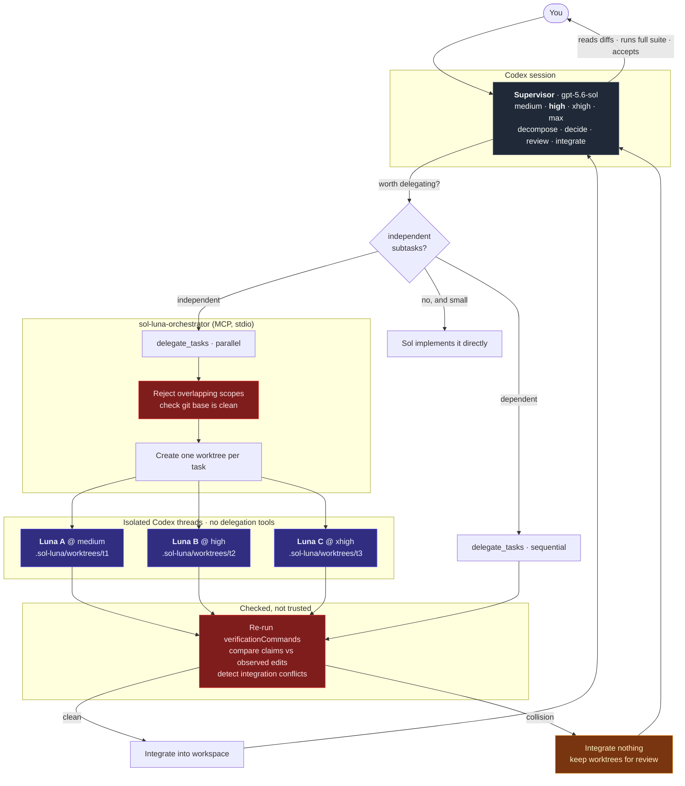

# sol-luna-orchestrator

[](https://www.npmjs.com/package/sol-luna-orchestrator)
[](https://github.com/mahadansar/sol-luna-orchestrator/actions/workflows/ci.yml)
[](#requirements)
[](LICENSE)

An MCP server that lets a supervising OpenAI Codex agent delegate bounded
implementation tasks to isolated worker threads — one at a time, or several in
parallel in their own git worktrees — with a declared file scope per task,
scope-violation detection, and results the orchestrator verifies instead of
taking on trust.

The supervisor (`gpt-5.6-sol`, high effort by default) decides _what_ should
happen, whether delegating is even worth it, and reviews what comes back.
Workers (`gpt-5.6-luna`, at an effort chosen per task) do the contained
implementation work in their own Codex threads.

```
delegate_tasks({
  mode: "parallel",
  tasks: [
    { objective: "Implement the retry helper...", effort: "medium",
      allowedFiles: ["src/retry.mjs"],  verificationCommands: ["node --test test/retry.test.mjs"] },
    { objective: "Implement money formatting...", effort: "high",
      allowedFiles: ["src/money.mjs"],  verificationCommands: ["node --test test/money.test.mjs"] },
    { objective: "Diagnose the ordering bug...", effort: "xhigh",
      allowedFiles: ["src/pool.mjs"],   verificationCommands: ["node --test test/pool.test.mjs"] },
  ],
})
→ 3/3 passed · 3 isolated worktrees · no integration conflicts · changes merged
```

Two ideas do most of the work here: **a worker's `PASS` is a claim, not a
conclusion**, and **not every task should be delegated**.

## Quick start

Prerequisite: [OpenAI Codex](https://developers.openai.com/codex) installed and
authenticated (`codex login`).

```bash
npm install -g sol-luna-orchestrator
sol-luna-orchestrator init
```

Then open Codex, select **GPT-5.6 Sol at High effort**, and work normally.

```
You're the supervisor. src/auth/, src/payments/ and src/search/ each need their
failing tests fixed, and they don't touch each other. Use delegate_tasks in
parallel mode with one worker per module and a disjoint scope each. Pick each
worker's effort yourself, then review the diffs and run the full suite.
```

`init` registers the MCP server with Codex and applies the two settings Codex
needs for delegation to work at all. It changes only the keys it owns — your
comments, formatting and other MCP servers are left exactly as they were. Run it
twice and it says `Already configured`.

```bash
sol-luna-orchestrator doctor      # diagnose, with the fix for anything broken
sol-luna-orchestrator status      # short summary
sol-luna-orchestrator uninstall   # remove this project's entry, nothing else
```

<details>
<summary>Why two commands and not one <code>npx</code> line</summary>

A single `npx sol-luna-orchestrator init` would be shorter and would work today.
It would also write a Codex config pointing into npm's `_npx` cache, which npm
deletes whenever it feels like it — leaving a configuration that silently stops
working weeks later with no obvious cause. `init` refuses that by default.

If you want it on one line, chain the two commands your shell's way:
`npm i -g sol-luna-orchestrator && sol-luna-orchestrator init` in bash, zsh or
PowerShell 7; use `;` instead of `&&` in Windows PowerShell 5.

</details>

## Should I use this?

Honest answer, from this project's own measurements:

**Use Sol directly when** the task is small, touches one or few files, has no
useful decomposition, or when explaining it would take longer than doing it. On
small tasks delegation measured ~2.3x slower and ~3.5x the tokens, with no
quality difference.

**Orchestration is worth considering when** a task has two or more genuinely
independent workstreams, when you want a declared file scope per unit of work
with violations reported rather than discovered later,
when you want verification re-run independently of the agent claiming it passed,
or when one long session would lose coherence.

**What the benchmarks have and have not shown.** Parallel delegation beat
sequential delegation in every task and every repetition (median 155s vs 248s).
Orchestrated execution has **not** yet beaten Sol High working alone on any
fixture in the suite — solo was ~63s. No token saving and no cost saving has been
demonstrated; orchestration used more tokens in every measured configuration.
The fixtures are small by construction, which is exactly the regime that favours
solo, so the crossover point is unknown rather than proven absent. Details in
[`bench/RESULTS.md`](bench/RESULTS.md).

## Why it exists

Not because delegation is always cheaper. On small tasks it measurably is not —
this project's own benchmark says so, and that result is
[documented rather than buried](#benchmarks). Delegation earns its keep when work
stops fitting in one head: when a session is long enough to lose coherence, when
changes need an enforced boundary, when "it passed" needs to mean more than the
model saying so, or when several independent pieces of work can genuinely run at
the same time.

The split is the one most teams already use with people:

- **The supervisor** holds requirements, architecture, decomposition,
  cross-cutting decisions, and review. It has the context; it makes the calls.
- **Workers** do bounded implementation, test writing, mechanical refactors, and
  focused investigation. They need a clear brief, not the whole picture.

The second idea is that **reasoning effort should be allocated, not fixed**.
Running every worker at maximum effort wastes time and tokens on work that was
mechanical to begin with. The supervisor picks effort per task from _that task's_
difficulty — and a batch of three workers routinely runs at three different
efforts.

## Who it's for

- Developers using OpenAI Codex who want more structure than one long session.
- Engineers in medium or large repositories where "change these three files" is a
  genuinely separable unit of work.
- People experimenting with multi-agent coding who want the delegation boundary
  to be explicit, declared, and checkable rather than emergent.
- Anyone who wants reasoning effort allocated per task rather than fixed for a
  whole session — mechanical work at `medium` while the hard task gets `xhigh`.

Not, on current evidence, anyone looking to spend fewer tokens: orchestration
used more of them in every configuration measured so far.

## Adaptive orchestration

There are three execution modes, and choosing between them is the supervisor's
job. The tool descriptions push it to justify the choice rather than reach for
delegation reflexively.

| Mode                      | When                                                 | Isolation                              | Can save wall-clock?             |
| ------------------------- | ---------------------------------------------------- | -------------------------------------- | -------------------------------- |
| **Sol only**              | Small, mechanical, one-file, or already-known edits  | —                                      | n/a — usually the fastest option |
| **Sol + sequential Luna** | Substantial work; later tasks depend on earlier ones | Shared workspace, one worker at a time | No                               |
| **Sol + parallel Luna**   | Two or more genuinely independent pieces of work     | One git worktree per worker            | Yes                              |

Sequential mode deliberately shares the workspace: a later task is _supposed_ to
see the earlier one's changes. Parallel mode deliberately does not.

## Architecture



The red boxes are what separates this from a plain "spawn subagents" tool: a
batch is refused before it starts if the scopes collide, and worker output is
treated as evidence to be checked rather than as a result.

## Requirements

- **Node.js ≥ 22.12** — tested in CI on 24 (active LTS) and 26 (current). Node 20
  and earlier are end-of-life and are neither tested nor supported.
- **OpenAI Codex CLI**, logged in (`codex login`). Built against `codex-cli 0.147.0`.
- **git ≥ 2.20** — only for parallel batches, which use `git worktree`.
- Access to `gpt-5.6-sol` and `gpt-5.6-luna`. Check with
  `codex exec -m gpt-5.6-luna "say ok"`.

`sol-luna-orchestrator doctor` verifies all of this and tells you what to do
about anything missing.

## Advanced installation

`init` is the supported path. These notes are for people who want to know what it
does, or who prefer to do it themselves.

### From a clone

```bash
git clone https://github.com/mahadansar/sol-luna-orchestrator.git
cd sol-luna-orchestrator
npm install && npm run build
node dist/cli.js init
```

### What init writes

One table in `~/.codex/config.toml` (or `$CODEX_HOME/config.toml`):

```toml
[mcp_servers.sol-luna-orchestrator]
command = "/path/to/node"
args = ["/path/to/sol-luna-orchestrator/dist/server.js"]
tool_timeout_sec = 3600                   # default is 60s; delegations take minutes
default_tools_approval_mode = "approve"   # "auto" does NOT work here
startup_timeout_sec = 30

[mcp_servers.sol-luna-orchestrator.env]
SOL_LUNA_LOG = "/path/to/sol-luna-orchestrator.log"
```

Both of the first two settings are required and were found the hard way: Codex's
60s default tool timeout aborts every delegation mid-flight, and
`default_tools_approval_mode` must be `"approve"` — `"auto"`, despite the name,
makes non-interactive runs cancel the call.

A fully annotated example is in [`examples/codex-config.toml`](examples/codex-config.toml).

### Why init edits the file directly

`init` does not use `codex mcp add`. That command round-trips the whole config:
measured against codex-cli 0.147.0, adding a server deleted the comment above an
unrelated `context7` table and rewrote that server's `startup_timeout_sec = 15`
as `15.0`. `init` edits only the keys it owns, so comments, formatting, key order
and other servers survive byte for byte. Every write is atomic and leaves a
`config.toml.sol-luna-backup`.

### Installing without a global install

`npx sol-luna-orchestrator init` works, but `init` will refuse to register a
package running from an npx cache: npm can evict that directory, leaving a Codex
config that points at nothing. Install it properly, or pass `--allow-ephemeral`
if you understand the trade.

## Tools

### `delegate_task`

One bounded task, run directly in the workspace. No git requirement.

### `delegate_tasks`

Several tasks, `mode: "parallel"` or `mode: "sequential"`. Each task carries its
own contract and its own effort. Parallel mode:

- refuses up front if two tasks declare overlapping `allowedFiles`
- refuses if the repo has uncommitted changes inside a declared scope
- gives every worker its own detached worktree branched from `HEAD`
- integrates results only when no two workers changed the same file
- keeps the worktrees when they collide, so you can merge them yourself

Both tools share the same task contract: `objective`, `effort`, `effortReason`,
`taskCategory`, `allowedFiles`, `forbiddenFiles`, `acceptanceCriteria`,
`verificationCommands`, `previousAttempts`.

## Configuration

Everything is environment variables set by _you_ — never by the model. That
separation is the core of the security model.

### Required Codex settings

| Setting                       | Value       | Why                                                                                |
| ----------------------------- | ----------- | ---------------------------------------------------------------------------------- |
| `tool_timeout_sec`            | `3600`      | Codex's 60s default aborts every real delegation                                   |
| `default_tools_approval_mode` | `"approve"` | Permits the tool without prompting. `"auto"` causes `user cancelled MCP tool call` |

### Environment variables

| Variable                          | Default                 | Purpose                                                        |
| --------------------------------- | ----------------------- | -------------------------------------------------------------- |
| `LUNA_MODEL`                      | `gpt-5.6-luna`          | Worker model                                                   |
| `LUNA_TIMEOUT_SECONDS`            | `1800`                  | Wall-clock budget per delegated task                           |
| `LUNA_SANDBOX`                    | `workspace-write`       | Codex sandbox mode for workers                                 |
| `LUNA_NETWORK_ACCESS`             | off                     | `1` allows workers network access                              |
| `SOL_LUNA_MAX_PARALLEL`           | `3`                     | Concurrent workers; hard ceiling 8                             |
| `SOL_LUNA_WORKTREE_LINK`          | `node_modules`          | Directories linked into each worktree                          |
| `SOL_LUNA_KEEP_WORKTREES`         | `onFailure`             | `always`, `never`, or `onFailure`                              |
| `SOL_LUNA_ALLOW_DIRTY`            | off                     | `1` permits parallel batches over uncommitted in-scope changes |
| `SOL_LUNA_VERIFY_MODE`            | `allowlist`             | `allowlist`, `off`, or `shell` — see [Security](#security)     |
| `SOL_LUNA_VERIFY_ALLOW`           | —                       | Extra permitted executables, comma separated                   |
| `SOL_LUNA_VERIFY_ENV_PASSTHROUGH` | off                     | `1` stops withholding credential-shaped env vars               |
| `SOL_LUNA_ALLOWED_ROOTS`          | —                       | Confine delegation to these directory trees                    |
| `SOL_LUNA_SERVER_NAME`            | `sol-luna-orchestrator` | **Must match** the name registered in Codex                    |
| `SOL_LUNA_LOG`                    | —                       | Tee diagnostics to a file (best troubleshooting signal)        |
| `SOL_LUNA_EVENTS`                 | —                       | JSONL telemetry: batches, workers, worktrees, conflicts        |

## Usage telemetry

Set `SOL_LUNA_EVENTS=/path/to/events.jsonl` and every run appends structured
records: batch start and finish, each worker's start, completion, effort and
model, worktree creation and removal, verification outcomes, scope and
integration conflicts.

Per worker, the following are recorded exactly as the Codex SDK reports them on
`turn.completed`:

| Field                   | Meaning                                   |
| ----------------------- | ----------------------------------------- |
| `inputTokens`           | Prompt tokens for that worker's turn      |
| `cachedInputTokens`     | Portion of the input served from cache    |
| `outputTokens`          | Tokens the worker generated               |
| `reasoningOutputTokens` | Reasoning portion of the output           |
| `model`, `effort`       | Which model and effort that worker ran at |
| `durationSeconds`       | Wall-clock for that worker                |

The supervisor's own usage is not visible to this server — Codex does not report
the parent turn to an MCP server it launched. The benchmark harness records it
separately because it drives the supervisor itself. Anything unavailable is
written as `null` rather than zero, so absent data is never mistaken for free.

### Cost

- **Token counts are measured.** They come from the API, per turn, per worker.
- **No currency figure is produced, by design.** Prices are not exposed through
  this integration.
- **Your Codex subscription is not a function of token counts.** Multiplying
  tokens by a public price list would produce an API-equivalent number that has
  no relationship to what you are actually billed.
- If you want an estimate, export the JSONL and apply your own pricing — the raw
  per-worker numbers are all there.
- Nothing in this project claims a cost saving, because none has been measured.

## Supervisor effort

The supervisor model is `gpt-5.6-sol`. Its effort is yours to set, not the
model's to change mid-session.

| Effort     | Use for                                                                                                         |
| ---------- | --------------------------------------------------------------------------------------------------------------- |
| `medium`   | Simple but non-trivial work whose decomposition is already obvious                                              |
| **`high`** | **Default.** Architecture, decomposition, delegation, review, normal multi-file engineering                     |
| `xhigh`    | Difficult architecture, subtle production bugs, cross-service reasoning, tricky concurrency, hard decomposition |
| `max`      | Exceptional supervisor-level problems only — not a routine setting                                              |

The model also advertises `low` and `ultra`; neither is recommended here.

## Worker effort

Chosen per task by the supervisor, defaulting to `high`. In a parallel batch each
worker can differ — and in practice they do.

| Task shape                                              | Effort             |
| ------------------------------------------------------- | ------------------ |
| Rename, move, boilerplate, applying an existing pattern | `medium`           |
| Obvious test cases for already-defined behaviour        | `medium`           |
| A new endpoint or feature with real business logic      | `high` _(default)_ |
| A bug fix with a reliable repro                         | `high`             |
| A focused refactor inside one module                    | `high`             |
| Concurrency, ordering, transactions, tricky state       | `xhigh`            |
| A bug whose cause is not yet identified                 | `xhigh`            |
| Intricate algorithmic work with real correctness risk   | `max`              |
| Anything that already failed at `xhigh`                 | `max`              |

Two rules carry most of the weight:

- **Importance is not difficulty.** A critical but mechanical task is `medium`.
- **Escalate rather than start high.** Run at `high`; if it fails _because the
  task was hard_, re-delegate at `xhigh` with `previousAttempts`. If it failed
  because the brief was vague, fix the brief. A scope violation or a timeout is
  never an effort problem.

Across every benchmark run of both suites, the supervisor never selected `max`.
That is a statement about the fixtures — all small, all well-specified — not
evidence that `max` is useless. It is the setting the policy reserves, and no
task in the suite was hard enough to reach for it.

Full rules are in [`SOL_RULES.md`](SOL_RULES.md). They also reach the supervisor
automatically through the MCP tool descriptions, so no setup is needed.

## When NOT to delegate

This is the most important section in this README, and it is backed by
measurement rather than opinion.

On four small single-file tasks, 16 runs, delegating was **worse on every axis**:

| Arm             | Passed  | Median wall-clock | Median output tokens | Median input tokens |
| --------------- | ------- | ----------------- | -------------------- | ------------------- |
| Sol high, solo  | **8/8** | **41s**           | **921**              | **67,805**          |
| Sol high + Luna | **8/8** | 96s               | 3,275                | 229,854             |

~2.3x slower, ~3.5x the tokens, no measurable quality difference. If your task is
small, well-specified and solvable in one pass, **do it yourself**. The tool
descriptions tell the supervisor exactly this.

## When parallelism helps

The parallel suite runs two projects that each contain three independent modules.
24 runs across six arms, all passing. Three findings, all measured:

**Parallel delegation beats sequential delegation, every time.** With delegation
mandated so both arms genuinely delegate three workers:

| Task                 | Sequential | Parallel | Solo (high) |
| -------------------- | ---------- | -------- | ----------- |
| parallel-toolkit     | 225s       | **164s** | 62s         |
| parallel-httpkit     | 402s       | **144s** | 73s         |
| **median, all runs** | **248s**   | **155s** | **63s**     |

Parallel won in every task and every repetition, and was far more consistent
(122–183s vs 193–565s). Sequential pays the sum of three worker times, so one slow
worker drags the whole run.

**But neither beat the supervisor doing it directly** on fixtures this size. Each
module is 15–30 lines against a fixed test file — too small to amortise a contract
per task, a thread per worker, a verification pass per worker and an integration
step.

**And the supervisor mostly agreed.** When left to decide, it declined to delegate
in 5 of 8 runs, implementing the modules itself instead. That is the delegation
policy working, not a bug.

So the honest rule is qualitative, not numeric: **when you delegate independent
work, use parallel — but "should I delegate at all?" is a separate question, and
for small work the answer is usually no.** This suite cannot locate the crossover
point, because every fixture in it sits below that point. Full data, including a
`solo-xhigh` arm that varied 4x between two repetitions, is in
[`bench/RESULTS.md`](bench/RESULTS.md).

Across every parallel batch that actually ran workers — 5 batches, 15 workers —
there were **zero integration conflicts**: the supervisor produced disjoint
scopes every time and every batch merged cleanly. `max` effort was never selected
by any run of either suite, which says these fixtures were never hard enough to
warrant it rather than that `max` has no use.

## Benchmarks

Two suites, both reproducible, both graded by the harness after the agent stops —
never by the agent:

```bash
npm run bench:validate                    # proves fixtures discriminate; no model calls
npm run bench -- --suite micro            # small tasks: delegation overhead
npm run bench -- --suite parallel         # multi-module projects: 4 arms
npm run bench:report                      # summarise the newest raw results
```

A task passes only if its checks exit 0, files marked immutable are
byte-identical (SHA-256), and — where a fixture defines one — the authored test
suite actually fails against a deliberately broken implementation.
`bench:validate` proves every fixture fails in its starting state and passes with
a committed reference solution, so a green score cannot come from a broken grader.

Full methodology, per-task numbers and what could not be measured are in
[`bench/RESULTS.md`](bench/RESULTS.md). Raw records are committed alongside it.

## Security

Read [`SECURITY.md`](SECURITY.md) before pointing this at anything you care
about. The short version:

**Enforced**

- Verification commands are parsed into argv with **no shell**. `;`, `&&`, `|`,
  backticks and `$(…)` are rejected, not executed. Only allowlisted executables
  may launch, and never via a path.
- Credential-shaped environment variables are withheld from verification
  commands, whose output flows back into a model transcript.
- Workspace escapes are caught after resolving symlinks. `allowedFiles: ["**"]`
  still cannot authorize writing outside the workspace.
- Workers cannot delegate — enforced by config _and_ by an environment marker
  that makes a worker-side server register zero tools.
- Parallel batches are refused when scopes overlap, and worker changes are never
  merged when two workers touched the same file.

**Not enforced — know this**

- **Scope is checked after the fact, not prevented.** Workers really write files.
- **Verification runs outside the Codex sandbox**, with your user's permissions.
  `npm test` runs your project's test code, which can do anything you can.
- **Parallel batches write inside your repository**, under `.sol-luna/worktrees/`,
  and add that path to `.git/info/exclude`. Integration copies files into your
  working tree.
- `SOL_LUNA_VERIFY_MODE=shell` disables all command protections. Opt-in, logged
  loudly.
- This is a set of guardrails, **not a sandbox**.

## Cross-platform support

Statuses reflect what has actually been executed, not what the code intends.

Two different things get called "supported", so they are reported separately.
**Deterministic CI** runs the build, typecheck, format check, unit, security,
parallel-orchestration and CLI suites, the MCP protocol handshake and the
benchmark fixture validation — no model access. **Live model testing** drives
real Codex sessions with real Sol and Luna turns.

| Platform       | Deterministic CI | Live Codex delegation | Notes                                                                       |
| -------------- | ---------------- | --------------------- | --------------------------------------------------------------------------- |
| **Windows 11** | Verified         | **Verified**          | Single + parallel delegation, worktree lifecycle, CLI lifecycle, benchmarks |
| **Linux**      | Verified         | Not yet run           | `ubuntu-latest`, GitHub-hosted                                              |
| **macOS**      | Verified         | Not yet run           | `macos-latest`, GitHub-hosted                                               |

Platform-specific behaviour is exercised by real code paths rather than mocked:
worktree tests create actual git worktrees and directory links, and the CLI tests
spawn the real binary, so each runner tests its own filesystem and process
semantics (path separators, case sensitivity, symlink support, file locking).
Windows uses junctions and `taskkill /T` for process-tree cleanup; POSIX uses
directory symlinks and process-group kills.

What that means in practice: the code paths that differ per platform are proven
on all three, but only Windows has been driven end to end with a live model.
Treat Linux and macOS as expected-to-work with the mechanics verified, rather
than as proven end to end.

## Troubleshooting

`SOL_LUNA_LOG` is ground truth for the first three. Model self-reports are not: a
low-effort model will cheerfully claim it has a tool it does not have.

| Symptom                                                | Cause                                                                                                                      |
| ------------------------------------------------------ | -------------------------------------------------------------------------------------------------------------------------- |
| Log file never created                                 | Codex never started the server — config or path problem. Check `codex mcp get`.                                            |
| Log has `client connected` but no `delegate_task` line | The server is fine; the model chose not to call it. Prompt more directly.                                                  |
| `user cancelled MCP tool call`                         | `default_tools_approval_mode` missing or `"auto"`. It must be `"approve"`.                                                 |
| Delegations die at ~60 seconds                         | `tool_timeout_sec` is missing.                                                                                             |
| `not inside a git repository` on a parallel batch      | Parallel mode needs git worktrees. Use `mode: "sequential"`, or `git init` + one commit.                                   |
| `uncommitted changes inside the file scopes`           | Workers branch from `HEAD` and would not see that work. Commit, stash, narrow the scopes, or set `SOL_LUNA_ALLOW_DIRTY=1`. |
| `overlapping file scopes`                              | Working as intended. Give disjoint scopes or use sequential mode.                                                          |
| Verification fails with "module not found" in a batch  | The worktree link for `node_modules` failed. Check the task warnings; see `SOL_LUNA_WORKTREE_LINK`.                        |
| Worktrees left in `.sol-luna/worktrees/`               | Expected after a failure or a conflict (`SOL_LUNA_KEEP_WORKTREES`). Safe to delete; a later batch prunes stale ones.       |
| `Command refused by verification policy`               | Working as intended. One command per entry, no `&&`; or permit the executable via `SOL_LUNA_VERIFY_ALLOW`.                 |
| A worker appears able to delegate                      | Don't trust the model's answer. Run `npm run smoke:isolation`.                                                             |

## Limitations

- **Delegation is not free**, and for small tasks it is measurably worse. See
  [When NOT to delegate](#when-not-to-delegate).
- **Parallel mode requires git** with at least one commit and a clean in-scope
  working tree.
- **Integration is a file copy, not a merge.** It is only attempted when worker
  file sets are disjoint; anything else is handed back to you.
- **Workers are verified in isolation.** Passing separately is not passing
  together — the supervisor is told to run the full suite after integration.
- **Verification is not sandboxed.** See Security.
- **Scope enforcement is detective, not preventive.**
- **Built against experimental surfaces.** Several behaviours this depends on are
  undocumented and were established by testing (see `CHANGELOG.md`). Upstream
  changes may break it.
- **Linux and macOS are CI-verified only** — no live model runs there yet.
- **Benchmarks are small.** Directional, not statistically significant.

## Roadmap

Not built yet — listed as intent, not as features:

- **A larger benchmark suite**, with realistic fixtures big enough to investigate
  whether a break-even point between Sol-only and orchestrated execution exists
  at all. Every fixture measured so far sits below any such point, so the suite
  cannot see it; that is a gap in the measurement, not evidence of a crossover
  waiting to be found.
- **Optional worker continuation** — letting the supervisor resume an existing
  Luna thread for bounded follow-up or revision work instead of always starting a
  fresh worker. Supervision, file scope and the no-recursive-delegation guarantee
  would have to hold for the resumed turn exactly as they do for the first.
- **Sandboxed verification** — investigating whether verification commands can
  run inside the Codex sandbox rather than in the orchestrator's own process.
  Today they run beside it, with your user's permissions; see
  [Security](#security). Whether this is achievable depends on upstream Codex
  capabilities and is not committed to.
- Automatic retry with effort escalation, driven by `previousAttempts`
- Live end-to-end verification on Linux and macOS

## License

MIT — see [LICENSE](LICENSE).
